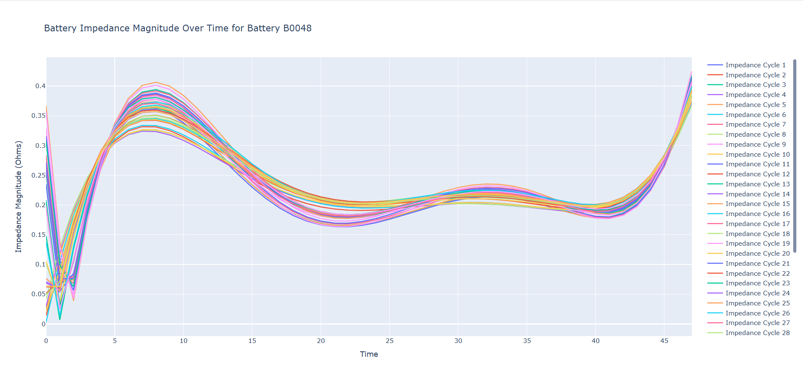
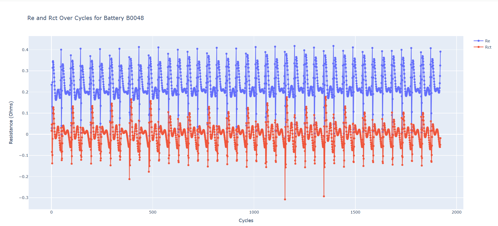

# Battery Data Analysis and Visualization

This project processes and visualizes **battery performance data** such as charging, discharging, impedance, and resistance measurements. The code uses **Python** and **Plotly** to create insightful plots, enabling deeper analysis of battery health over time.

## Table of Contents
- [Overview](#overview)
- [How to Run](#how-to-run)
- [Sample Visualizations](#Sample-Visualizations)

---

## Overview

The project reads battery datasets, processes them, and creates visualizations that make sense of:
1. Battery charging and discharging behavior.
2. Impedance magnitude trends.
3. Resistance components \(Re and Rct\) over multiple test cycles.

The **time** from the battery test files is utilized as the x-axis to ensure meaningful graphs. It helps researchers, engineers, and analysts assess battery health, capacity, and degradation trends.

---


## How to Run

Follow these steps to run the analysis:

1. **Clone the repository**:
   ```bash
   git clone https://github.com/yourusername/battery-graph-analysis.git
   cd battery-graph-analysis
```
2. **Install required dependencies**:
 ```bash
  pip install requirements.txt
```
3. **Downlode Data**:
 ```bash
  python downlode.py
```
4. **Run Script**:
 ```bash
  python app.py
```
## Sample Visualizations
Here is an example of the battery impedance graph:



And here is the graph for the change in `Re` and `Rct` values over cycles:




